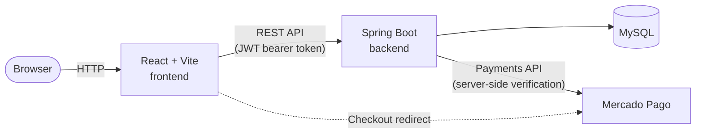

# Trémolo

A full-stack e-commerce demo for a fictional musical instrument store, built as a portfolio project. Customers browse a public catalogue and check out with Mercado Pago; ADMIN and OPERADOR users manage the catalogue from an admin panel with role-based permissions, sales charts, and Excel/PDF exports.

> Originally built in 2024 as a university assignment. The version in this repository is a substantial rewrite done later as a portfolio piece — security hardening, JWT auth with role-based permissions, a full visual redesign, real Mercado Pago payment verification, and more.

This repository holds two independent projects:

- **[Backend/](Backend)** — Spring Boot REST API (Java, MySQL, JWT auth, Mercado Pago integration). See [Backend/README.md](Backend/README.md).
- **[Frontend/](Frontend)** — React + TypeScript single-page app. See [Frontend/README.md](Frontend/README.md).

## Tech stack

| | |
|---|---|
| **Backend** | Java 17, Spring Boot 3.2.5, Spring Security, Spring Data JPA / Hibernate, MySQL, JWT (jjwt), Bean Validation, Apache POI (Excel export), iText (PDF export), Mercado Pago Java SDK, Gradle |
| **Frontend** | React 18, TypeScript, Vite, React Router 6, Bootstrap 5.3.3 (CDN), react-google-charts, react-modal, Mercado Pago React SDK |

## Architecture



The frontend never trusts itself for money: cart totals, order creation, and payment status are all recomputed and verified on the backend against the database and the Mercado Pago API.

## Features

- **Public catalogue** — browse and filter instruments by category, view product detail pages, no account required.
- **Cart + checkout** — Mercado Pago Checkout Pro, with the backend recalculating prices from the database and verifying the payment status server-side (a client can never mark its own order as paid).
- **Role-based access** — JWT authentication with three roles (`ADMIN`, `OPERADOR`, `VISOR`), each with different permissions on the API and a different admin UI.
- **Admin panel** — create/edit/soft-delete/reactivate instruments, upload product photos from disk, manage categories and users (ADMIN only).
- **Sales reporting** — bar and pie charts plus an Excel export, all scoped to orders that were actually paid.
- **Printable datasheet** — per-instrument PDF export.
- **Light/dark theme** — applied with no flash on first paint, including inside the charts.
- **Fully responsive layout.**

## Demo credentials

| Username | Password | Role | Can do |
|---|---|---|---|
| `admin` | `admin123` | ADMIN | Everything: catalogue, categories, users, orders, sales stats and exports |
| `operador` | `operador123` | OPERADOR | Manage the instrument catalogue (create/edit/deactivate/reactivate), upload photos, generate the PDF datasheet |
| `visor` | `visor123` | VISOR | Browse the catalogue (including deactivated items) and check out |

These are seed accounts created automatically on first run (see [`DataInitializer`](Backend/src/main/java/com/example/TiendaDeMusica/config/DataInitializer.java)) and are left visible on purpose — this is a portfolio project meant to be tried out, and the values already live in plain text in that tracked source file, so hiding them here wouldn't add any real protection. No real payment ever happens: Mercado Pago is wired to test/sandbox credentials.

## Getting started

Each project has its own setup instructions. In short:

```bash
# Backend — from Backend/, after configuring application-local.properties
./gradlew bootRun

# Frontend — from Frontend/, in another terminal
npm install
npm run dev
```

Then open `http://localhost:5173`. See [Backend/README.md](Backend/README.md) and [Frontend/README.md](Frontend/README.md) for full setup, environment variables, and everything each side offers.

## Author

Built by [Flor Gubiotti](https://github.com/FlorGubiotti) as a portfolio project. Prices, products, and orders are all demo data.
